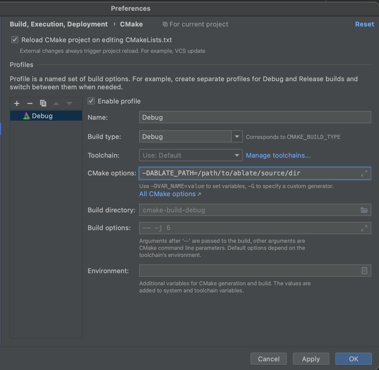

# ABLATE Client Template
An example ABLATE client that illustrates using ABLATE in your application.  See the [ABLATE documentation](https://ubchrest.github.io/ablate/) for details about the library. If developing features for ABLATE you may want to specify a local build of ABLATE instead of downloading it.  This can be done with the CMAKE option ABLATE_PATH.  For example if configuring on the command line:
    
    ```bash
    cmake -DABLATE_PATH=/path/to/ablate/source/dir  -S ../ablateClientTemplate -B .
    ```

or if using CLion [specify the option](https://www.jetbrains.com/help/clion/cmake-profile.html) as shown.
    